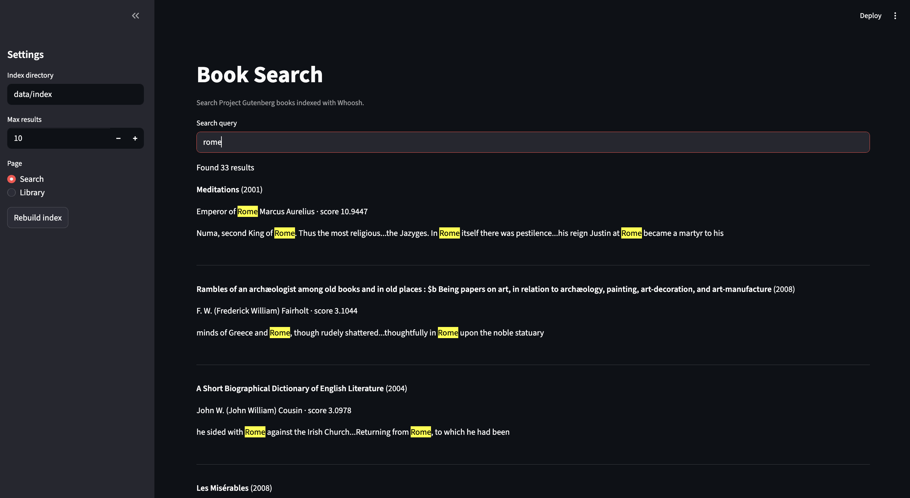
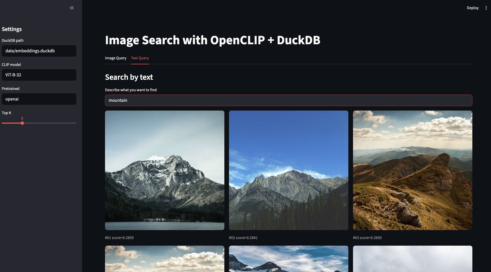
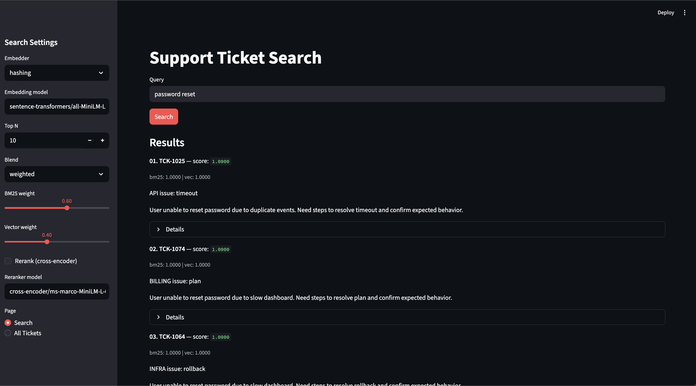

# Search Engines

This repository implements 3 different types of search systems: traditional full-text search, vector search and hybrid search.

## Projects

### 1) Book Search (Project Gutenberg) - Lexical/Text Search
Keyword search over public‑domain books using Whoosh.
- Data download + normalization pipeline
- BM25F scoring with field boosts
- CLI + Streamlit UI


See: `book-search/README.md`

### 2) Image Search (OpenCLIP + DuckDB) - Vector Search
Image and text search over a small image set.
- OpenCLIP embeddings stored in DuckDB
- Query by text or image
- CLI + Streamlit UI


See: `image-search/README.md`

### 3) Support Ticket Search - Hybrid Search with Reranking
Hybrid search for support tickets and KB docs.
- BM25 (Whoosh) + vector search (DuckDB vss)
- Optional cross‑encoder reranking
- CLI + Streamlit UI


See: `support-ticket-search/README.md`

## Quickstart

Each project is standalone. Create a virtualenv and follow its README:

- `book-search/README.md`
- `image-search/README.md`
- `support-ticket-search/README.md`

## Run all Streamlit apps (different ports)

Run these three commands (one per terminal):

```bash
cd support-ticket-search && streamlit run app.py --server.port 8501
cd book-search && streamlit run app.py --server.port 8502
cd image-search && streamlit run app.py --server.port 8503
```
