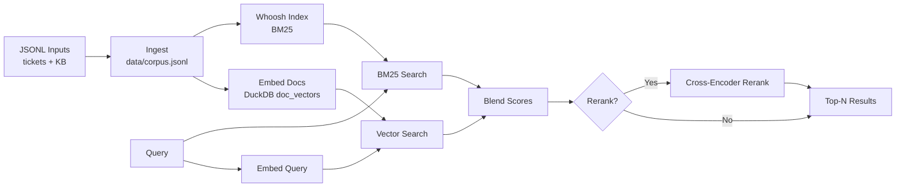
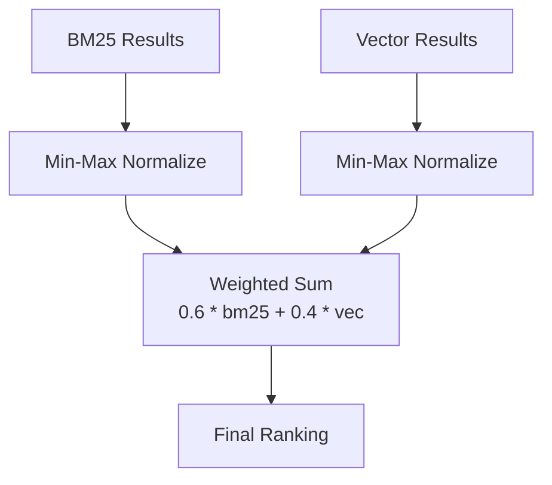

# Support Ticket Search (CLI)

A minimal hybrid search CLI for support tickets and knowledge base docs.
- BM25 via Whoosh
- Vector search via DuckDB (vss extension if available)
- Optional reranking (cross-encoder)

## Quickstart

```bash
python -m venv .venv
source .venv/bin/activate
pip install -r requirements.txt

# Load sample data
python -m src.cli ingest --input data/sample_tickets.jsonl --input data/sample_kb.jsonl

# Build indexes
python -m src.cli index
python -m src.cli embed

# Search
python -m src.cli search "rotate s3 access key" --top-n 5
```

## Streamlit UI

```bash
streamlit run app.py
```

## How the search engine works (end-to-end)

This project uses a **hybrid search pipeline**: BM25 keyword search + vector search, then blends the scores and optionally reranks results.

### Pipeline diagram



### Score blending diagram



### 1) Ingest: build a corpus
Command: `python -m src.cli ingest --input <file1.jsonl> --input <file2.jsonl>`

- Reads JSONL files with documents (tickets and KB articles).
- Deduplicates by `doc_id`.
- Writes a unified corpus to `data/corpus.jsonl`.

Expected JSONL format:
```json
{"doc_id":"TCK-001","title":"...","body":"...","source":"ticket|kb","created_at":"2025-12-05","tags":["s3","auth"]}
```

### 2) Index: build the BM25 index
Command: `python -m src.cli index --rebuild`

- Reads `data/corpus.jsonl`.
- Builds a Whoosh index in `whoosh_index/`.
- Fields indexed: `title`, `body`, plus stored metadata (`doc_id`, `source`, `created_at`, `tags`).
- Whoosh uses BM25 scoring internally for keyword relevance.

### 3) Embed: create vector representations
Command: `python -m src.cli embed --rebuild`

- Generates embeddings for each document using the configured embedder:
  - Default: deterministic hashing embedder (no external model).
  - Optional: `sentence-transformers` for higher quality embeddings.
- Stores embeddings in DuckDB table `doc_vectors` inside `vectors.duckdb`.
- Vector search requires DuckDB `vss` extension.

### 4) Search: hybrid retrieval
Command: `python -m src.cli search "your query"`

Under the hood:
1. **BM25 search** (Whoosh):
   - Runs the query against `title` and `body`.
   - Returns top‑K results with BM25 scores.
2. **Vector search** (DuckDB vss):
   - Embeds the query using the same embedder.
   - Runs nearest‑neighbor search via `list_distance(embedding, query_embedding)`.
   - Converts distance to a similarity score: `score = 1 / (1 + distance)`.
3. **Score blending**:
   - Min‑max normalizes BM25 scores and vector scores independently to 0–1.
   - Combines with a weighted sum:
     - `final = 0.6 * bm25_norm + 0.4 * vec_norm` (defaults).
   - Alternative: Reciprocal Rank Fusion (RRF) via `--blend rrf`.
4. **Optional reranking**:
   - If `--rerank` is enabled, a cross‑encoder scores `(query, doc_text)` pairs.
   - The list is reordered by the reranker’s relevance score.

### 5) Evaluate (optional)
Command: `python -m src.cli eval --queries data/queries.jsonl`

- Runs the same hybrid pipeline on a set of labeled queries.
- Reports:
  - `MRR@N` (mean reciprocal rank)
  - `Recall@N` (hit rate in top N)

### 6) UI (optional)
Command: `streamlit run app.py`

- Interactive UI for the same hybrid search flow.
- Includes a “Search” page and an “All Tickets” page.

## Commands
- `ingest`: Merge JSONL files into `data/corpus.jsonl` (dedup by `doc_id`).
- `index`: Build Whoosh index from `data/corpus.jsonl`.
- `embed`: Create embeddings and store in DuckDB.
- `search`: Run hybrid search (BM25 + vector) with blending.
- `eval`: Run a simple evaluation using `data/queries.jsonl`.

## Data format (JSONL)
Each line:
```json
{"doc_id":"TCK-001","title":"...","body":"...","source":"ticket|kb","created_at":"2025-12-05","tags":["s3","auth"]}
```

## Notes
- The default embedder is a deterministic hashing embedder (no extra deps).
- For better quality, install `sentence-transformers` and use `--embedder sentence-transformers`.
- DuckDB vss is required for vector search.
